# 시연 시나리오

> 보라색 표시는 커서의 위치를 나타냈습니다

1. 책 정보 리스트
   

2. 책 정보 상세보기

   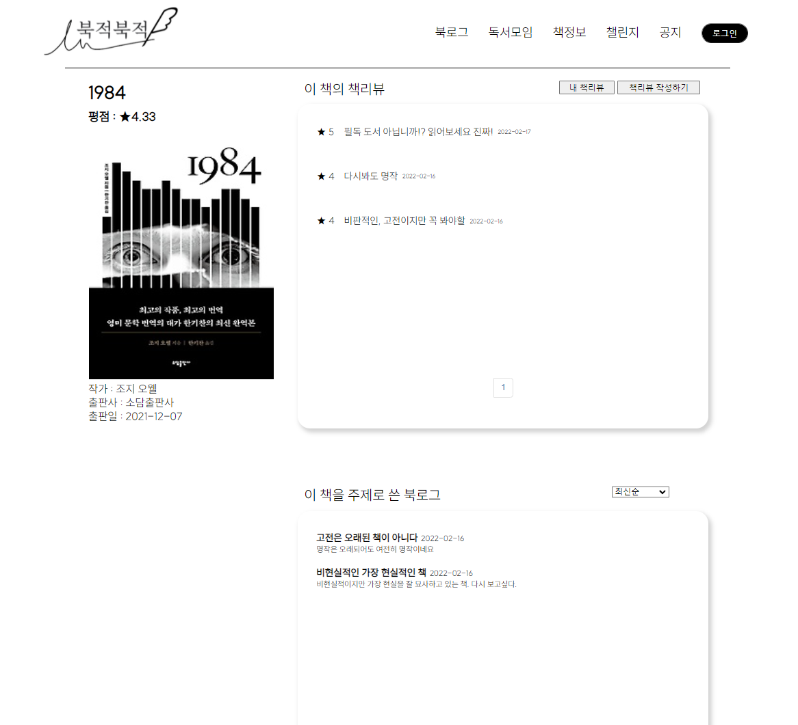

3. 책 정보 상세보기 → 한줄평&별점 입력

   

4. 로그인

   

5. 책 정보 상세보기 → 북로그 이동

   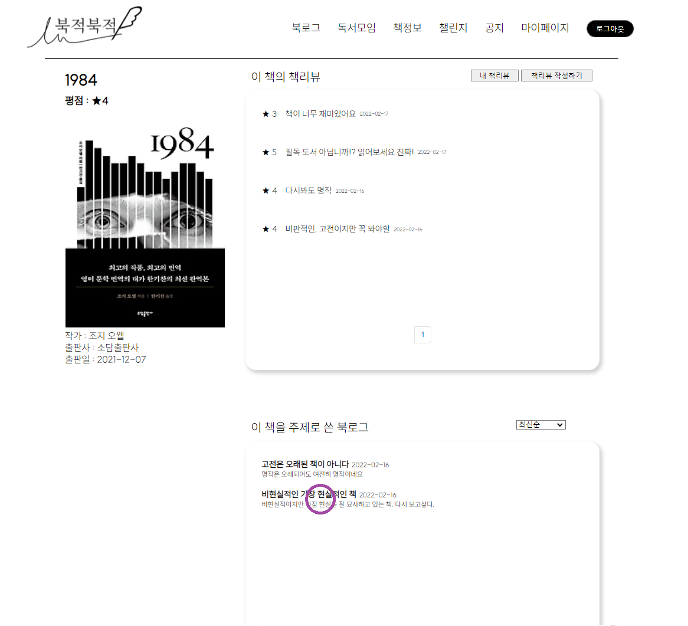

   

6. 모든 공개된 북로그 상세보기

   

7. 공개된 북로그 검색

   

   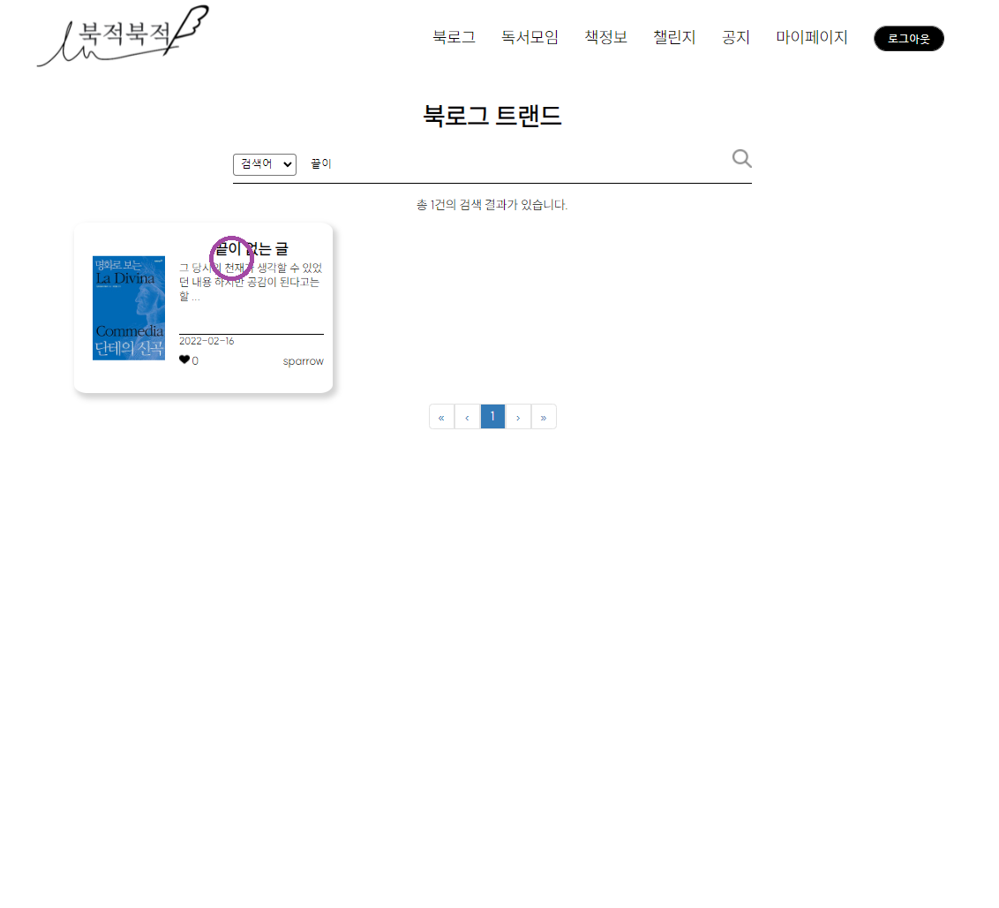

8. 공개된 북로그 상세보기 하트기능

   

9. 마이페이지 → 나의 북로그 리스트

   

10. 마이페이지 → 나의 북로그 작성

    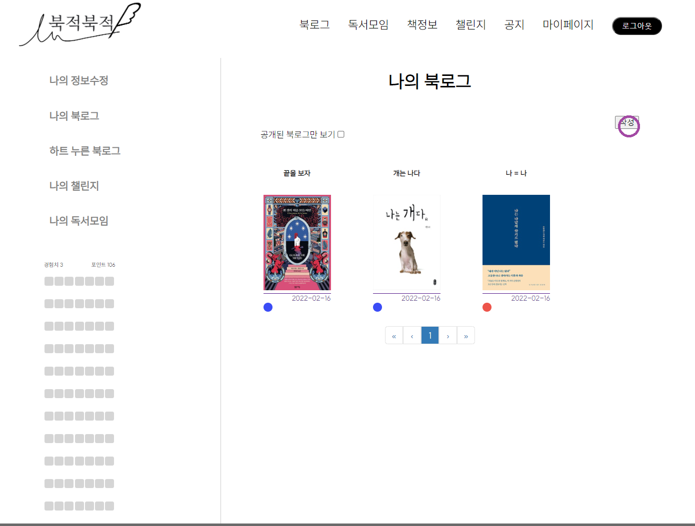

11. 나의 북로그 공개 설정

    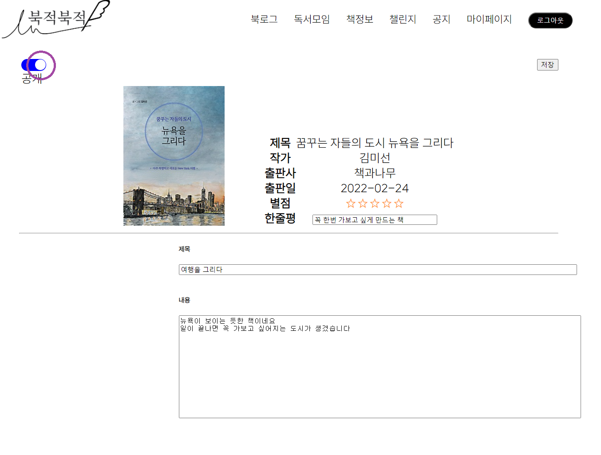

    

12. 모든 공개된 북로그 리스트에 내가 공개 설정한 북로그가 보이는지

    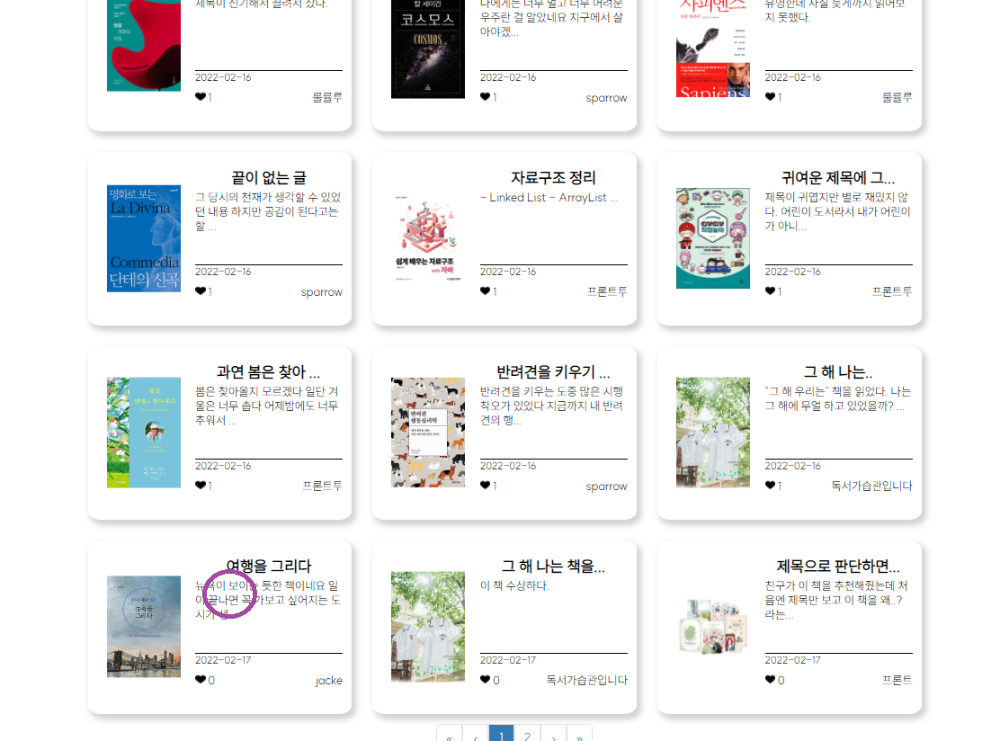

13. 모든 공개된 북로그 리스트에서 클릭해 공개 설정한 나의 북로그 상세보기

    

14. 독서 모임 리스트

    

    

15. 독서 모임 참여 신청(fail, 레벨 blocking)

    

16. 독서 모임 참여 신청(success)

    

17. 독서 모임 포스팅 작성

    

    

18. 마이페이지 → 나의 독서모임 리스트

    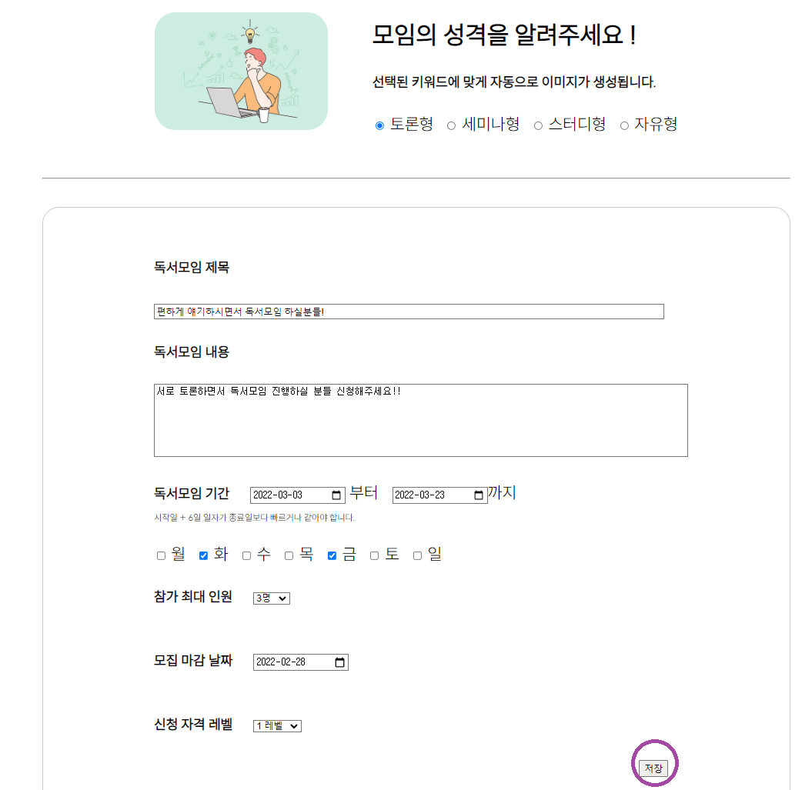

19. 마이페이지 → 나의 독서모임 리스트 → 독서모임 상세페이지

    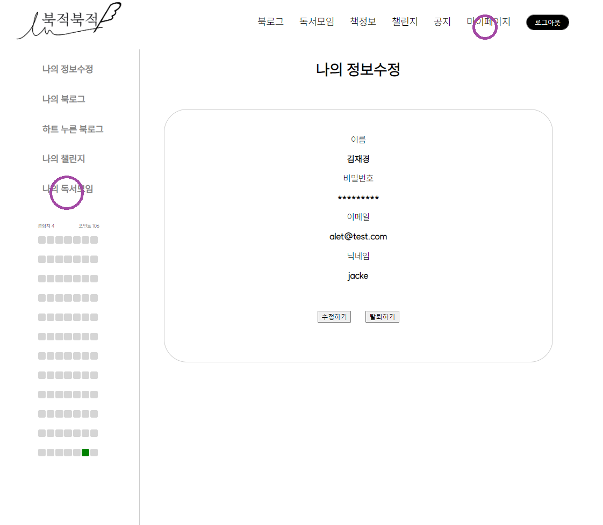

20. 나의 독서모임 상세페이지 → 나의 독서모임 게시판 리스트

    

    

    

21. 나의 독서모임 게시판 게시글 작성

    

22. 나의 독서모임 게시판 게시글 리스트(작성한게 잘 들어가 있는지)

    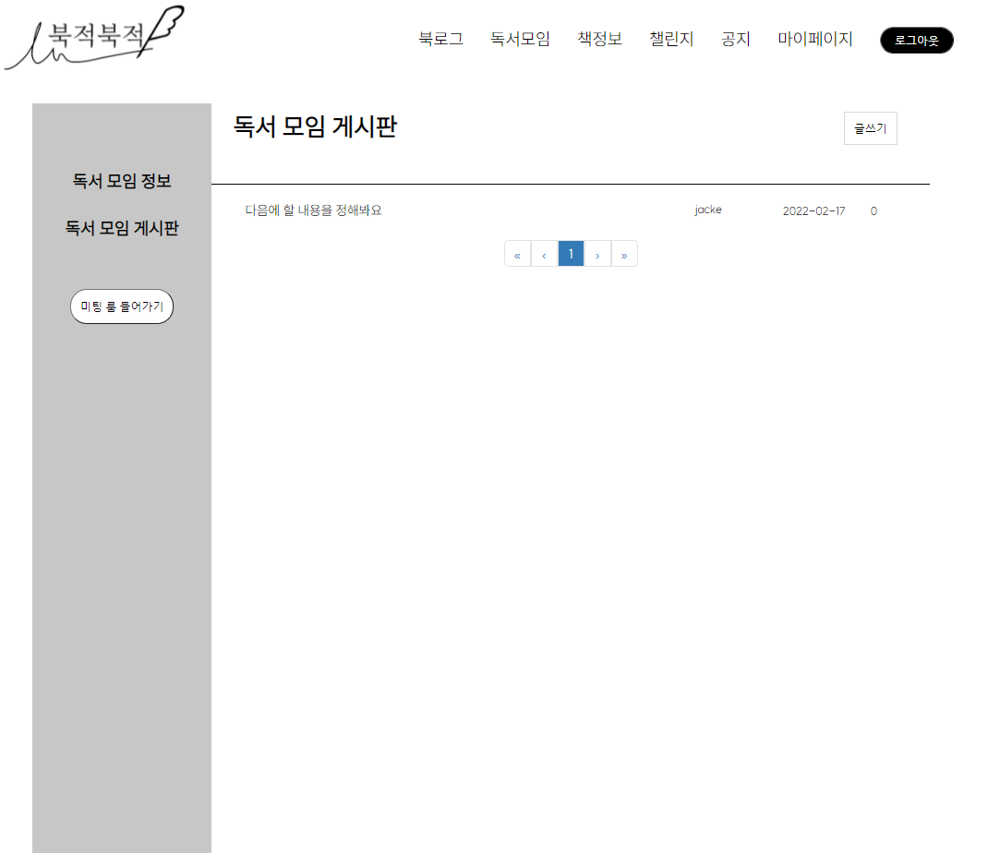

23. 나의 독서모임 게시판 게시글 상세보기(작성한게 잘 들어가 있는지)

    

24. 나의 독서모임 미팅으로 이동(success)

    

    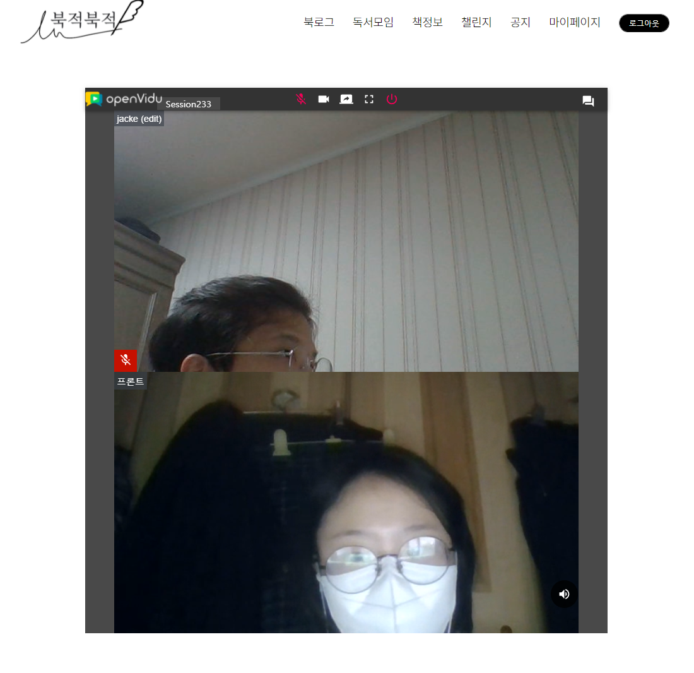

25. 잔디, 경험치, 포인트

    

26. 나의 챌린지 접근

    

    

27. 챌린지 인증

    

28. 로그아웃

    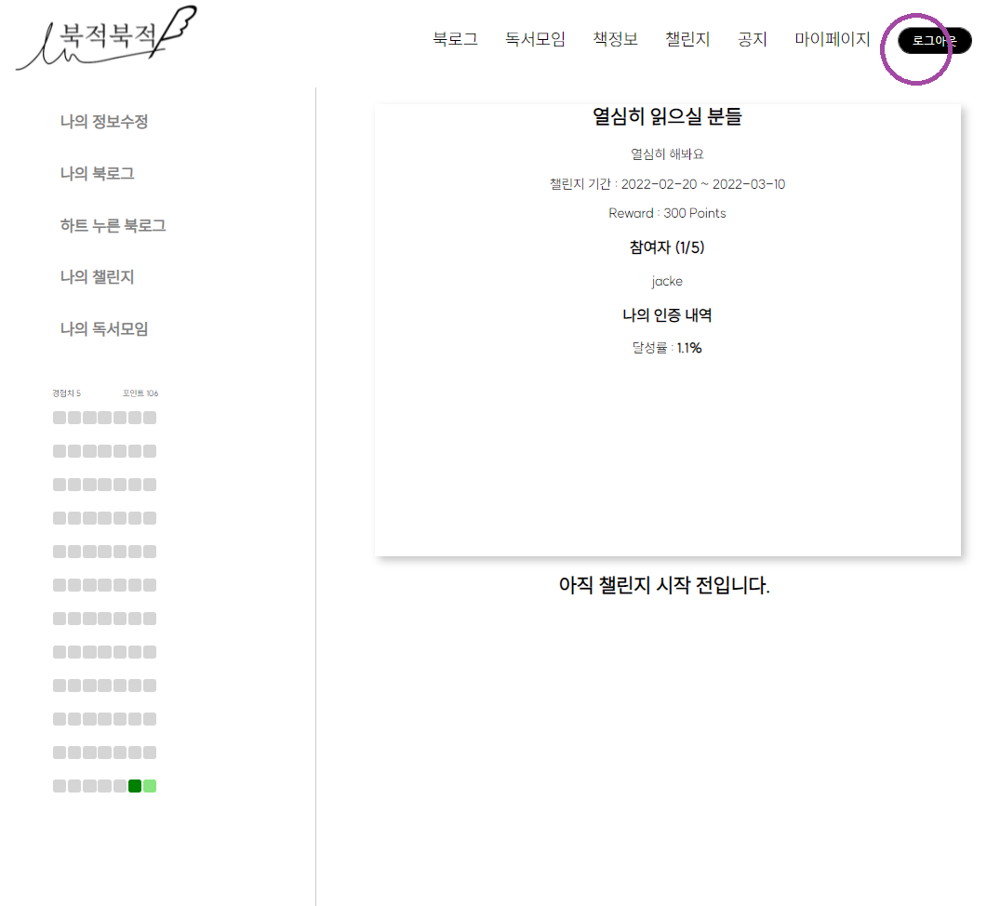

